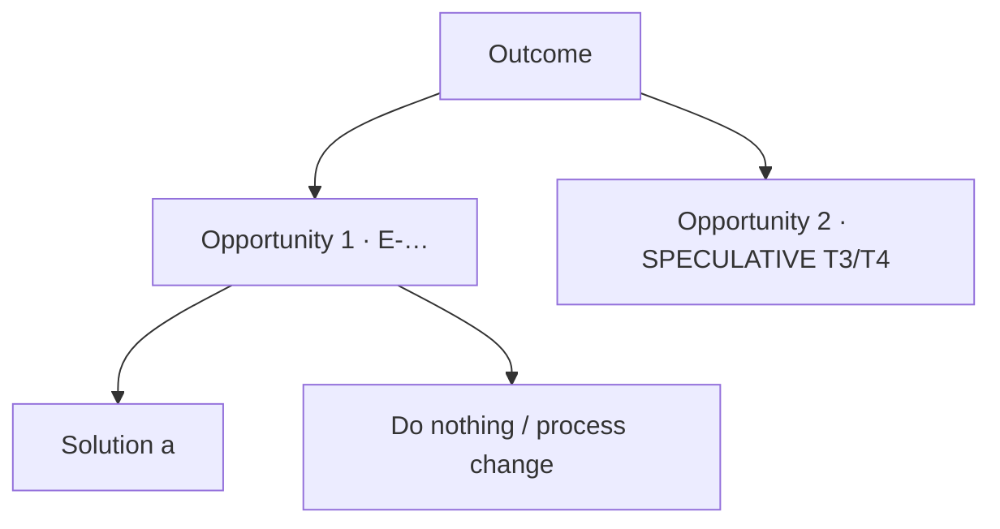

# Opportunity Solution Tree

decision_id: ""
desired_outcome: "" (one per tree)

| Opportunity | Evidence (T1/T2 or SPECULATIVE) | Current alternative (incl. do nothing) | Candidate solutions |
|---|---|---|---|
| | | | |

## Ruled out
| Opportunity | Why |
|---|---|
